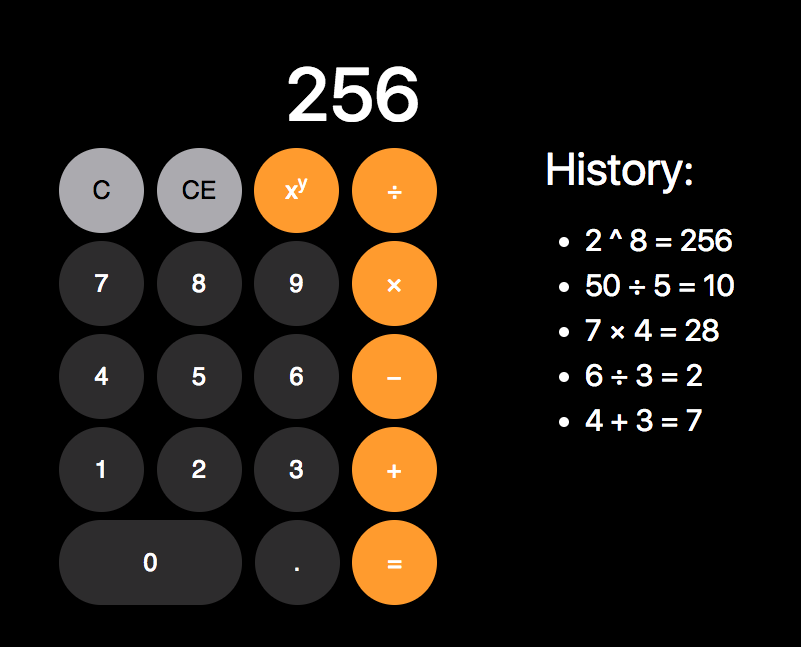

# Weekend 2 Challenge 
## Node.js Calculator App
A calculator application that can perform the following calculations:

- Addition
- Subtraction
- Multiplication
- Division

Calculations are not limited to whole numbers and can include decimals.

User input is sent from the client side for processing on the server. 

The history section, lists the calculations done since the last clear. If an item in the history section is clicked the result of that item will show on the calculator window.

The theme is based off of the look and feel of the Apple iOS calculator. 

## Built using:
 - HTML
 - CSS/Bootstrap
 - JavaScript
 - jQuery
 - Node.js
 - Express.js
